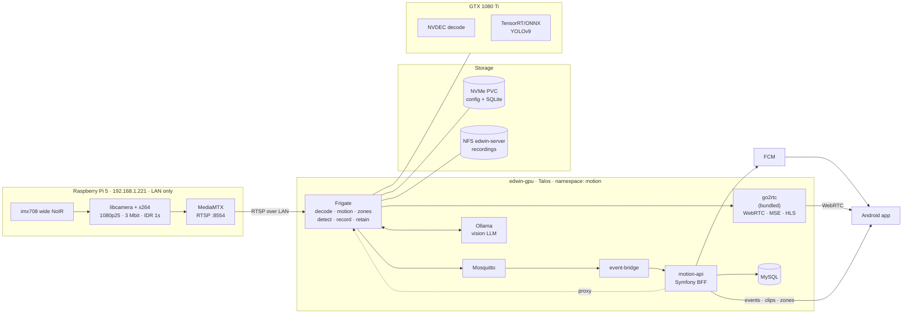

# Target architecture

## The problem with the current shape

The system today works, and the way it works is the ceiling it will hit.

```
Pi:  capture_array() → cvtColor RGB→BGR → imencode JPEG   (per frame, 1080p, ~30 fps)
       ↓ same JPEG
     absdiff vs previous → threshold → countNonZero        (motion)
       ↓
     H264Encoder → motion_<ts>.h264 → POST multipart       (recording)
       ↓
API: move to private/ → ffmpeg re-encode with vflip → mp4  (transcode)
       ↓
App:                      (live, MJPEG through PHP)
```

Five things are structurally wrong with it, and none of them are bugs you can fix:

| Problem | Why it cannot be tuned away |
|---|---|
| JPEG-encoding every frame in Python | 1080p JPEG at 30 fps is pure CPU burn on a Pi with no encode silicon, and it happens *before* anything decides the frame is interesting |
| MJPEG for live view | No inter-frame compression: ~12–18 Mbit/s for a picture that H.264 sends in 3. And one long-lived PHP request per viewer |
| `countNonZero` as the detector | A pixel counter cannot tell a car from a cyclist from a cloud shadow. There is no path from here to labels |
| Recording starts *after* motion is confirmed | The first second — the interesting one — is always missing. A Ring camera shows you the approach, not the aftermath |
| The API re-encodes every clip to flip it vertically | Full transcode of every recording because the camera is mounted upside down. That is a capture setting, not a post-processing job |

The last one is worth pausing on: it is a one-line fix (`vflip` on the Pi) that removes an
entire ffmpeg pass, and it is a fair illustration of how much of the current cost is
accidental.

## The target



## Who owns what

The rule that keeps this from turning into two half-NVRs: **each concern has exactly one
owner.**

| Concern | Owner | Explicitly not |
|---|---|---|
| Capture, encode, publish | Pi (MediaMTX) | Anything else on the Pi |
| Decode, motion, zones, object detection | Frigate | The Pi, Symfony |
| Recording, segmenting, retention, pruning | Frigate | `FileCleanupMessageHandler` |
| Live restreaming (WebRTC/MSE/HLS) | go2rtc, inside Frigate | PHP proxying MJPEG |
| App identity, sessions, biometrics | Symfony | Frigate's own auth |
| Push notifications and their rules | Symfony | Frigate's web push |
| The app-facing contract | Symfony | The app talking to Frigate directly |
| The UI | Vue + Capacitor | Frigate's web UI |

Frigate is the **engine**; Symfony is the **product API**; the Vue app is the **product**.
Symfony never stores video again — it proxies Frigate and keeps a searchable mirror of the
event metadata so the app can query it cheaply without hammering Frigate's SQLite.

## Component inventory

| Component | Image / source | New? | Purpose |
|---|---|---|---|
| `mediamtx` | `bluenviron/mediamtx` on the Pi, systemd | new | One H.264 stream out of the camera |
| `frigate` | `ghcr.io/blakeblackshear/frigate:*-tensorrt` | new | The NVR: detect, record, retain, restream |
| `mosquitto` | `eclipse-mosquitto` | new | Frigate's event bus |
| `event-bridge` | ~150 lines of Python | new | MQTT → HTTP, so Symfony never speaks MQTT |
| `motion-api` | existing `api/` | changed | BFF: auth, events mirror, push, zone writes, media proxy |
| `motion-web` | existing `web/` | changed | The app, plus a static build served in-cluster |
| `ollama` | `ollama/ollama` | optional | Vision model for GenAI descriptions |
| `mysql` / CNPG | existing | changed | Only metadata now, no file bookkeeping |

Everything except MediaMTX runs in the `motion` namespace on `edwin-gpu`.

## Why Frigate rather than growing the Python detector

This is the load-bearing decision; the reasoning is in
[adr/0001-frigate-as-engine.md](adr/0001-frigate-as-engine.md). The summary:

Everything you asked for — zones, pre-roll recording, object labels, GPU inference,
retention budgets, low-latency streaming, a scrubbable timeline, snapshots, search — is
already a feature of Frigate, and each one is a multi-week project in the current codebase.
Roughly 1500 lines of Python and PHP get *deleted*, and what you build instead is the part
nobody else can build for you: your app, your notification rules, your session model.

The honest cost: you inherit someone else's config format, upgrade cadence and opinions, and
one of those opinions (Frigate rewrites its own `config.yml`) conflicts with pure GitOps. See
[adr/0005-frigate-config-on-pvc.md](adr/0005-frigate-config-on-pvc.md).

## The life of a clip, v2

```
1. capture    libcamera → x264 1080p25, IDR every second, vflip applied at capture
2. publish    MediaMTX serves rtsp://192.168.1.221:8554/cam  (LAN, ~3 Mbit)
3. ingest     Frigate connects; NVDEC on the 1080 Ti decodes; frames go two ways:
                 - copied to disk continuously (no re-encode)
                 - downscaled for the detect pipeline
4. motion     cheap frame-difference on the downscaled stream, minus motion masks
5. detect     YOLOv9 (TensorRT) runs only on the moving regions → labelled boxes
6. track      boxes become tracked objects with a lifetime, a best snapshot, a score
7. zone       an object entering the `voordeur` polygon sets zone membership
8. review     Frigate groups objects into a review item: "alert" (person/car in a zone)
              or "detection" (everything else)
9. record     segments already on disk are retained per the alert/detection budget —
              including the seconds BEFORE the trigger, because recording never stopped
10. enrich    optional: Ollama describes the review item; embeddings feed semantic search;
              a custom classifier adds a sub-label (bezorger / bewoner / onbekend)
11. publish   Frigate posts to MQTT topic frigate/reviews and frigate/events
12. bridge    event-bridge POSTs it to Symfony, which mirrors it into MySQL
13. notify    Symfony evaluates notification rules → FCM → phone buzzes with a thumbnail
14. play      the app opens /api/events/{id}/clip.mp4, proxied from Frigate with Range
```

Step 9 is the Ring behaviour you asked for and the reason continuous recording matters:
because the recorder is always writing, the clip can start *before* the trigger. Nothing in
the current design can do that.

## What gets deleted

| File / feature | Fate |
|---|---|
| `python/motion_detector.py` | deleted (Frigate) |
| `python/video_handler.py` | deleted (Frigate) |
| `python/camera_manager.py` | deleted (MediaMTX) |
| `python/web_server.py` | deleted (go2rtc) |
| `python/settings_manager.py`, `api_client.py` | deleted (no settings loop, no upload) |
| `POST /api/video/upload` | removed after the archive is frozen |
| `GET /api/video/stream-alt` (MJPEG proxy) | removed, replaced by WebRTC |
| `ProcessFileMessageHandler` (ffmpeg transcode) | removed — no re-encode in v2 |
| `FileCleanupMessageHandler` | removed — Frigate owns retention |
| `MotionDetectedFile` + existing clips | frozen as a read-only "Archief" section |

Do not migrate the old `.mp4` files into Frigate. They have no events, no labels and no
zones attached; they would show up as an unsearchable blob in an otherwise structured
timeline. Keep them behind an archive route until you no longer care.

## The lean alternative

If the BFF layer ever feels like ceremony, there is a smaller version of this architecture:
drop `motion-api` and point the app at Frigate's own HTTP API, which has JWT auth since
0.14. You lose the biometric session model, custom notification rules and the ability to
change the backend without shipping an app update. It is written up as the rejected option in
[adr/0006-keep-symfony-bff.md](adr/0006-keep-symfony-bff.md) so the door stays open.
