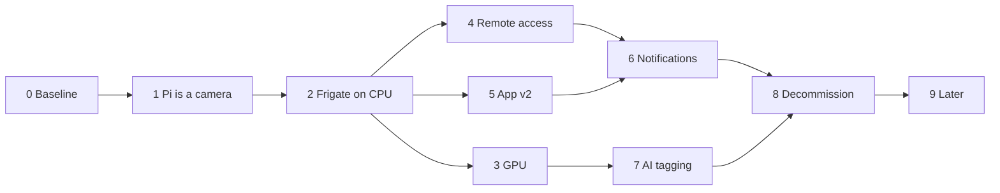

# Roadmap

Phases in the style of the homelab
[roadmap](../../../homelab-cluster/docs/roadmap.md): each one is finished when its
**Done when** is true, and you do not start the next while the previous still wobbles.

Effort is in evenings (~3 h) for someone who knows this codebase. They are estimates, and
the two that will be wrong are Phase 3 and Phase 7.

Phases 3, 4 and 5 are independent of each other. If an evening is short, do Phase 5 — it is
the one you can see.

---

## Phase 0 — Baseline and decisions · done 2026-09-02

| # | Decision | Answer |
|---|---|---|
| 1 | NFS target | `/mnt/external4/motion` (`/mnt/external` and `/mnt/external3` are at 98 %) |
| 2 | Retention | 3 days continuous, 30 days alerts |
| 3 | Remote access | Reuse the existing **Cloudflare Tunnel** ([adr/0004](adr/0004-tailscale-for-remote.md), revised) — not Tailscale. Live view falls back to MSE (~1 s) remotely; WebRTC stays LAN-only |
| 4 | Push | **Firebase (FCM)** ([adr/0007](adr/0007-fcm-for-push.md)) |
| 5 | Frigate version | **0.17.0** (stable-tensorrt), pinned by digest. Revisit 0.18 once it is out of beta — it moves config into the UI, which touches [adr/0005](adr/0005-frigate-config-on-pvc.md) but not its conclusion |
| 6 | Baseline "working" snapshot | Skipped — the old agent is not currently running, so there is nothing to diff against. Regressions get judged against this plan's numbers instead (§ [02-video-transport.md](02-video-transport.md#numbers-first)) |

**Done.** Everything below reflects these answers; the Kubernetes and API docs in this
folder were updated in place rather than left to contradict this table.

---

## Phase 1 — The Pi becomes a camera · 1 evening

Per [08-pi-agent.md](08-pi-agent.md). Install MediaMTX, write the config, systemd unit,
`vflip` at capture, keyframe every second.

The old agent keeps running until the last step; both want the camera, so the actual switch
is a stop-and-start with a tested rollback.

**Done when:** `ffplay rtsp://192.168.1.221:8554/cam` shows a stable, correctly-oriented
1080p25 picture for 24 h; Pi load average < 2.0; `vcgencmd get_throttled` returns `0x0`;
restarting the Pi brings the stream back unattended.

---

## Phase 2 — Frigate on the cluster, CPU only · 2–3 evenings

The big one, and deliberately **without the GPU** so it does not depend on a node
re-provision. OpenVINO on the i5-8600K handles one camera at 5 detect-fps.

Per [06-kubernetes.md](06-kubernetes.md): namespace, storage (config on NVMe, recordings on
NFS — never SQLite on NFS), HelmRelease, HTTPRoute on the internal gateway. Then in Frigate's
own UI: draw the zones, draw the motion masks, tune `threshold` and `contour_area`, set
retention.

**Done when:** events appear within seconds of walking past the camera; clips play in a
browser on the LAN; the recordings volume grows and then *stops* growing at the retention
budget after 72 h; Frigate survives a pod restart with its config and database intact.

> Tune the masks here, properly, before notifications exist. Every hour spent on masks in
> Phase 2 is an hour of not being woken up in Phase 6.

---

## Phase 3 — GPU · 1 evening of work, one maintenance window

Independent of everything else and the only phase with a blast radius outside this project.

1. Talos schematic with `nonfree-kmod-nvidia-production` and
   `nvidia-container-toolkit-production`
2. `machine.install.image` + `machine.kernel.modules`; **re-provision the node**
3. NVIDIA device plugin
4. `nvidia-smi` in a test pod
5. Frigate: `-tensorrt` image, ONNX detector, `USE_FP16=false`, `hwaccel_args: preset-nvidia`

**`edwin-gpu` is a single-node cluster that runs the Space Crucible production game.**
Re-provisioning takes production down. Schedule it, verify the CNPG restore first, and treat
it as a cluster change that the camera project happens to benefit from.

**Done when:** a pod sees the card; detector inference < 25 ms; Frigate's CPU drops
noticeably with NVDEC on; the game is back up and green.

---

## Phase 4 — Remote access · 1 evening

`motion.edwintenbrinke.nl` as an HTTPRoute on `envoy-external`, through the existing
Cloudflare Tunnel, picking up the existing wildcard cert — the same pattern as `plex.` and
`files.`. No new infrastructure. Per [adr/0004](adr/0004-tailscale-for-remote.md), the app
must land on the MSE rung here, not WebRTC — verify that fallback actually engages rather
than just timing out.

**Done when:** the live view works over 4G with the wifi off (via MSE, ~1 s — WebRTC is not
expected to connect off the LAN), and the same hostname works unchanged at home over WebRTC.

---

## Phase 5 — App v2 · built, pending a device

Per [05-android-app.md](05-android-app.md), built per
[10-app-v2-implementation.md](10-app-v2-implementation.md). The longest phase and the most
visible.

**Status:** the app is written and runs end to end against a mock adapter
(`npm run dev:mock`) — feed, event detail, live ladder, timeline, settings, push and deep
links. What is left is the half that needs hardware and a backend: an Android build, and
re-pointing `VITE_API_MODE` at a motion-api that serves the endpoints in
[HANDOFF](HANDOFF.md) § "App v2 needs these from motion-api".

Order that keeps it useful throughout: API client layer → events feed → event detail with
playback → WebRTC live → timeline scrubber → zone editor. The feed alone is already better
than the current calendar.

Build against Frigate's API directly if the BFF is not ready — that is what the thin client
layer is for.

**Done when:** you reach for the app instead of the browser; live view falls back gracefully
with the wifi degraded; zones drawn in the app take effect in Frigate within seconds.

---

## Phase 6 — Notifications · 2–3 evenings

Per [04-notifications.md](04-notifications.md). Mosquitto, the bridge, the rules engine,
FCM, signed media URLs for thumbnails, snooze, and the global rate cap.

Ship the rate cap and the cooldown in the *first* version, not the second.

**Done when:** walking to the front door buzzes the phone within 5 s with a thumbnail;
tapping opens the clip already playing; a car on the street does not buzz; a 50-event storm
produces one summary rather than 50 notifications; snooze works.

---

## Phase 7 — AI tagging · 2 evenings, then ongoing

The layered ladder in
[03-detection-and-ai.md](03-detection-and-ai.md#the-tagging-ladder). Layer 1 arrived free in
Phase 2. Then:

- Layer 2, zone + time rules in the BFF — an evening, deterministic, immediately useful
- Layer 4, Ollama + a vision model for descriptions and semantic search — an evening to wire
  up, and genuinely delightful
- Layer 3, the custom classifier for `bezorger` / `bewoner` — an afternoon of labelling,
  and it only gets good with feedback from the app over weeks

Do layer 2 before layer 4. Rules never hallucinate, and a lot of what feels like it needs a
model turns out to be "was it in the zone for more than eight seconds".

**Done when:** the feed shows a useful label on the large majority of events without you
opening the clip; searching "pakket" finds the right ones.

---

## Phase 8 — Decommission · 1 evening

Remove `POST /api/video/upload`, the two message handlers, `RaspberryApiService`, the MJPEG
proxy, and the dead `Settings` columns. Move `python/*.py` into `python/legacy/`. Freeze the
old clips behind an "Archief" route.

**Done when:** `grep -r picamera2 api/ web/` is empty, CI is green, and the archive still
plays.

---

## Phase 9 — Later

A second camera. A doorbell button. Home Assistant integration (Frigate speaks MQTT already).
Two-way audio, which needs a microphone and a speaker on the Pi. Face recognition for
suppressing your own family. A Grafana dashboard next to the host dashboards.

---

## Risks

| Risk | Likelihood | Impact | Mitigation |
|---|---|---|---|
| Node re-provision for the GPU takes down the game | certain | high | Phase 3 is independent; schedule a window; test the CNPG restore first |
| NFS target is full | high | high | Phase 0 check; `/mnt/external4`; retention is one number |
| SQLite on NFS corrupts the Frigate database | medium | high | Config PVC on NVMe. Stated three times in these docs for a reason |
| Pi 5 thermal throttling under sustained x264 | medium | medium | Active cooler; 25 fps not 50; monitor `get_throttled` |
| Notification fatigue kills the product | high | high | Masks in Phase 2, cooldown + rate cap + snooze in Phase 6's first version |
| Frigate config drift between git and the PVC | certain | medium | [adr/0005](adr/0005-frigate-config-on-pvc.md): PVC is the source, nightly export to git |
| Ollama and Frigate contending for 11 GB VRAM | medium | low | `keep_alive: -1`, GenAI on alerts only, or a nightly batch |
| Frigate breaking changes on upgrade | medium | medium | Pin the tag; read release notes; Renovate PRs reviewed, not auto-merged |
| Pascal dropped by a future CUDA | low (this year) | medium | Pinned images; the fallback is the OpenVINO CPU detector, which already works |
| Scope creep into a full NVR product | high | medium | Frigate is the engine. Every "we could also…" that belongs in Frigate goes in Frigate |

## Rollback

Up to and including Phase 5, the old system is intact: restart `main.py` on the Pi and the
current app keeps working. The point of no return is **Phase 8**, and it exists precisely so
there is one clearly-marked door rather than a slow drift into a state nobody can undo.
