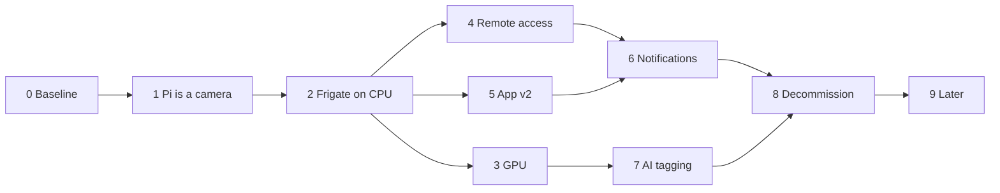

# Roadmap

Phases in the style of the homelab
[roadmap](../../../homelab-cluster/docs/roadmap.md): each one is finished when its
**Done when** is true, and you do not start the next while the previous still wobbles.

Effort is in evenings (~3 h) for someone who knows this codebase. They are estimates, and
the two that will be wrong are Phase 3 and Phase 7.

Phases 3, 4 and 5 are independent of each other. If an evening is short, do Phase 5 — it is
the one you can see.

---

## Phase 0 — Baseline and decisions · done 2026-09-02

| # | Decision | Answer |
|---|---|---|
| 1 | NFS target | `/mnt/external4/motion` (`/mnt/external` and `/mnt/external3` are at 98 %) |
| 2 | Retention | 3 days continuous, 30 days alerts |
| 3 | Remote access | Reuse the existing **Cloudflare Tunnel** ([adr/0004](adr/0004-tailscale-for-remote.md), revised) — not Tailscale. Live view falls back to MSE (~1 s) remotely; WebRTC stays LAN-only |
| 4 | Push | **Firebase (FCM)** ([adr/0007](adr/0007-fcm-for-push.md)) |
| 5 | Frigate version | **0.17.0** (stable-tensorrt), pinned by digest. Revisit 0.18 once it is out of beta — it moves config into the UI, which touches [adr/0005](adr/0005-frigate-config-on-pvc.md) but not its conclusion |
| 6 | Baseline "working" snapshot | Skipped — the old agent is not currently running, so there is nothing to diff against. Regressions get judged against this plan's numbers instead (§ [02-video-transport.md](02-video-transport.md#numbers-first)) |

**Done.** Everything below reflects these answers; the Kubernetes and API docs in this
folder were updated in place rather than left to contradict this table.

---

## Phase 1 — The Pi becomes a camera · streaming, one item open

Per [08-pi-agent.md](08-pi-agent.md). Install MediaMTX, write the config, systemd unit,
`vflip` at capture, keyframe every second.

The old agent keeps running until the last step; both want the camera, so the actual switch
is a stop-and-start with a tested rollback. In the event there was nothing to stop — no
`motion-detection` unit, no `main.py`, `/dev/video0` free — so the cutover was one
`systemctl start`.

**Done when:** `ffplay rtsp://192.168.1.221:8554/cam` shows a stable, correctly-oriented
1080p25 picture for 24 h; Pi load average < 2.0; `vcgencmd get_throttled` returns `0x0`;
restarting the Pi brings the stream back unattended.

**Where it stands (2026-09-03).** MediaMTX 1.20.1 installed, pinned by digest, enabled and
running; `python/deploy/` holds the config, unit, installer and a soak logger.

| Criterion | |
|---|---|
| Correctly-oriented 1080p25 | ✅ 1920×1080, 25.00 fps, 3.00 Mbit, keyframe every 25 frames, upright |
| Load average < 2.0 | ✅ 0.7–0.8. The encoder takes ~65 % of *one* core, not half the box |
| `get_throttled` = `0x0` | ✅ **solved by cooling, later the same day.** Was `0xe0006` at 83–86 °C; now a steady **42.8–45.5 °C** across four hours of soak log with no current-throttle bits. The remaining `0xe0000` are the since-boot flags from before and clear on the next reboot. Note the Pi still registers no fan in `hwmon` and no cooling device, so whatever was fitted is passive or unmanaged — it works, and nothing in software knows about it |
| Stable for 24 h | ⏳ soaking; `/var/log/mediamtx-soak.log` samples every 5 minutes |
| Reboot brings it back | ✅ rebooted 18:43, SSH back in 55 s, MediaMTX up and the path `ready` at 18:45:12 with nobody touching it; stream re-probed at 24.97 fps / 3.00 Mbit |

The throttling never cost frames — the numbers above were measured with the throttle bits
already set — but it was the one number the phase asked for. The soak log caught the fix
landing: 86 °C at 20:26, 43 °C from 20:42 onward and flat ever since, which is exactly the
claim that log was installed to be able to make.

---

## Phase 2 — Frigate on the cluster, CPU only · running, awaiting a walk past the camera

The big one, and deliberately **without the GPU** so it does not depend on a node
re-provision. OpenVINO on the i5-8600K handles one camera at 5 detect-fps.

Per [06-kubernetes.md](06-kubernetes.md): namespace, storage (config on NVMe, recordings on
NFS — never SQLite on NFS), HelmRelease, and a LAN `LoadBalancer` rather than a gateway
route. Then in Frigate's own UI: draw the zones, draw the motion masks, tune `threshold` and
`contour_area`, set retention.

**Done when:** events appear within seconds of walking past the camera; clips play in a
browser on the LAN; the recordings volume grows and then *stops* growing at the retention
budget after 72 h; Frigate survives a pod restart with its config and database intact.

**Where it stands (2026-09-03).** Frigate 0.17.2 is running in the `motion` namespace on
`edwin-gpu`, managed by Flux from `homelab-cluster` main. Reachable on the LAN at
**http://192.168.1.248:5000** — a `LoadBalancer` service, not an HTTPRoute, because this
cluster has no split-DNS and a hostname would send LAN traffic out through Cloudflare and
back to reach the machine in the next room. The public hostname is Phase 4's job.

| | |
|---|---|
| Pipeline | Pi → MediaMTX RTSP → go2rtc (one pull) → Frigate. Verified frame-by-frame over the LAN |
| Camera | `camera_fps` 5.1, `process_fps` 5.1, **`skipped_fps` 0.0** |
| Detector | OpenVINO on CPU, **17.5 ms** inference, `detection_fps` 6.8 |
| Frigate CPU | **1013 m** of its 2500 m limit. Node total 30 % — the game is untouched |
| Storage | NFS `nfs4` mount live, 3.9 TB free; recordings, previews and clips all writing |
| Retention | 3 days continuous, 30 alerts, 7 detections — as Phase 0 decided |

| Criterion | |
|---|---|
| Events on walking past | ✅ two `person` events, top score 0.74, in a dark room — detected by YOLOv9 on the GPU after Phase 3 landed |
| Clips play in a LAN browser | ✅ `/api/events/<id>/clip.mp4` returns 1.1 MB of fMP4, snapshot with bounding box alongside |
| Volume grows, then stops at 72 h | ⏳ 2.7 GB and climbing; the ceiling is the thing to check on 2026-09-06 |
| Survives a pod restart | ✅ restarted repeatedly since, including the GPU cutover; config, SQLite and recordings intact |

What is left is the work no amount of YAML substitutes for: **draw the zones and the motion
masks** in Frigate's UI. Note the two events above carry `zones: []` — nothing is scoped
yet, so every person anywhere in frame is an alert. Every hour spent there is an hour of not being
woken up in Phase 6.

> Tune the masks here, properly, before notifications exist. Every hour spent on masks in
> Phase 2 is an hour of not being woken up in Phase 6.

---

## Phase 3 — GPU · done 2026-09-03, in an hour, no maintenance window

Independent of everything else and the only phase with a blast radius outside this project.

The plan for this phase was wrong in two ways, and both were load-bearing.

1. ~~`nonfree-kmod-nvidia-production`~~ → **`nonfree-kmod-nvidia-lts`**. The production
   extension is on NVIDIA 595.71.05, and **580 is the last branch that supports Maxwell,
   Pascal and Volta**. A GTX 1080 Ti is GP102 — Pascal. Following the plan literally would
   have installed a driver that does not know this card, on a node that had just rebooted.
   `-lts` is 580.173.02; both NVIDIA extensions must carry the same driver version. This is
   the risk row "Pascal dropped by a future CUDA, likelihood: low (this year)" arriving.
2. ~~**re-provision the node**~~ → **upgrade it**. Talos installs system extensions through
   an upgrade to a new installer image; the rendered config keeps `wipe: false`. The
   maintenance window, the rebuild and the tested CNPG restore were all guarding against a
   wipe that a re-provision does and an upgrade does not. What was actually needed was one
   reboot, and the node was back in under two minutes.
3. NVIDIA device plugin + a **`RuntimeClass`** — the plan omitted the second, and without it
   a pod gets the ordinary runtime, no `/dev/nvidia*` and no driver libraries.
4. `nvidia-smi` in a test pod ✅ *GTX 1080 Ti, 11264 MiB, compute 6.1, driver 580.173.02*
5. Frigate: `-tensorrt` image, ONNX detector, `hwaccel_args: preset-nvidia`. **Not
   TensorRT** — see below. `USE_FP16=false` turned out to be unnecessary rather than
   critical: it belonged to the old TensorRT detector, and on the ONNX path the exported
   model is FP32 throughout, so Pascal's 1/64-rate FP16 never comes up.

> **The `-tensorrt` image has no TensorRT in it.** It ships CUDA 12 and cuDNN but no
> `libnvinfer` anywhere in the filesystem, so onnxruntime's `TensorrtExecutionProvider`
> fails to load and silently falls back to **CPU** — a GPU detector that is not on the GPU
> and reports nothing wrong. Both providers were tried in a pod on the node before the
> config was written; CUDA ran real inference. Ask for `type: onnx` and let Frigate choose.

> **Do not drain.** `talosctl upgrade` drains by default and there is nowhere to drain to on
> a single node. CNPG's single-instance PodDisruptionBudget blocks the eviction until the
> timeout, and what you are left with is a cordoned node, everything `Pending`, and no
> upgrade performed. `--drain=false`. This is how the first attempt failed.

**Done when:** a pod sees the card; detector inference < 25 ms; Frigate's CPU drops
noticeably with NVDEC on; the game is back up and green. **All four met:**

| | Before (OpenVINO on CPU) | After (ONNX on the 1080 Ti) |
|---|---|---|
| Model | ssdlite_mobilenet_v2 | **YOLOv9-tiny 320** |
| Inference | 17.5 ms | **8.1 ms** (target was < 25) |
| Frigate CPU | 1013 m | **229 m** |
| Node CPU | 30 % | **20 %** |
| H.264 decode | CPU | **NVDEC** |
| VRAM | — | 433 MiB of 11 GB |
| The game | — | back up, green, 54/54 pods running |

The halved inference time is the least of it. The model is a class better, and that is what
makes the labels in Phase 7's feed worth reading. **The model is in neither git nor the
image** — nothing ships a YOLO ONNX — so it is exported onto the config PVC by
`kubernetes/apps/motion/frigate/model-export.job.yaml`, a committed one-shot that takes two
minutes.

---

## Phase 4 — Remote access · done 2026-09-03

`motion.edwintenbrinke.nl` as an HTTPRoute on `envoy-external`, through the existing
Cloudflare Tunnel, picking up the existing wildcard cert — the same pattern as `plex.` and
`files.`. No new infrastructure. Per [adr/0004](adr/0004-tailscale-for-remote.md), the app
must land on the MSE rung here, not WebRTC — verify that fallback actually engages rather
than just timing out.

**Done when:** the live view works over 4G with the wifi off (via MSE, ~1 s — WebRTC is not
expected to connect off the LAN), and the same hostname works unchanged at home over WebRTC.

**Done.** `motion.edwintenbrinke.nl` is an HTTPRoute on `envoy-external` through the existing
tunnel; external-dns wrote the record from the route itself, so there was no new DNS,
certificate or tunnel configuration at all. The MSE rung was verified through the tunnel and
answers **101 Switching Protocols** — the fallback engages rather than timing out, which is
the thing this phase was told to check. The last mile, "over 4G with the wifi off", is yours
to confirm on the phone; everything between here and the tunnel is proven.

See [11-deployment.md](11-deployment.md).

---

## Phase 5 — App v2 · deployed, pending a device

Per [05-android-app.md](05-android-app.md), built per
[10-app-v2-implementation.md](10-app-v2-implementation.md). The longest phase and the most
visible.

**Status (2026-09-03):** it is live at **https://motion.edwintenbrinke.nl**, running against
the real motion-api, with real events from the camera. Not against the mock any more.

Built and verified: login, the event feed with **inline signed media**, thumbnails and
snapshots and clips that serve with no session at all and 403 when tampered with or expired,
the camera list read from Frigate's live config, and the live ladder — MSE over WebSocket
through the tunnel, LL-HLS, single frames, with WebRTC offered LAN-only because it cannot
traverse the tunnel.

Frigate is not reachable from the internet at all: no HTTPRoute, no tunnel entry, and the
route has exactly two backends. Every byte the app shows is fetched by nginx inside the
motion-api pod after PHP has checked a signature or a session.

The feed is filled by a one-minute poll of Frigate's events API rather than by Phase 6's
MQTT bridge, because the difference between "works" and "looks broken" should not be a
message broker. It upserts on Frigate's id, so it stays useful as a reconciler afterwards.

Still missing, and visible in the app as "nog niet beschikbaar" rather than as errors: the
timeline (H4), zones and notification rules (H9), push (H5), and the search/date filters
(H7). Full account: [11-deployment.md](11-deployment.md).

Order that keeps it useful throughout: API client layer → events feed → event detail with
playback → WebRTC live → timeline scrubber → zone editor. The feed alone is already better
than the current calendar.

Build against Frigate's API directly if the BFF is not ready — that is what the thin client
layer is for.

**Done when:** you reach for the app instead of the browser; live view falls back gracefully
with the wifi degraded; zones drawn in the app take effect in Frigate within seconds.

---

## Phase 6 — Notifications · 2–3 evenings

Per [04-notifications.md](04-notifications.md). Mosquitto, the bridge, the rules engine,
FCM, signed media URLs for thumbnails, snooze, and the global rate cap.

Ship the rate cap and the cooldown in the *first* version, not the second.

**Done when:** walking to the front door buzzes the phone within 5 s with a thumbnail;
tapping opens the clip already playing; a car on the street does not buzz; a 50-event storm
produces one summary rather than 50 notifications; snooze works.

---

## Phase 7 — AI tagging · 2 evenings, then ongoing

The layered ladder in
[03-detection-and-ai.md](03-detection-and-ai.md#the-tagging-ladder). Layer 1 arrived free in
Phase 2. Then:

- Layer 2, zone + time rules in the BFF — an evening, deterministic, immediately useful
- Layer 4, Ollama + a vision model for descriptions and semantic search — an evening to wire
  up, and genuinely delightful
- Layer 3, the custom classifier for `bezorger` / `bewoner` — an afternoon of labelling,
  and it only gets good with feedback from the app over weeks

Do layer 2 before layer 4. Rules never hallucinate, and a lot of what feels like it needs a
model turns out to be "was it in the zone for more than eight seconds".

**Done when:** the feed shows a useful label on the large majority of events without you
opening the clip; searching "pakket" finds the right ones.

---

## Phase 8 — Decommission · 1 evening

Remove `POST /api/video/upload`, the two message handlers, `RaspberryApiService`, the MJPEG
proxy, and the dead `Settings` columns. Move `python/*.py` into `python/legacy/`. Freeze the
old clips behind an "Archief" route.

**Done when:** `grep -r picamera2 api/ web/` is empty, CI is green, and the archive still
plays.

---

## Phase 9 — Later

A second camera. A doorbell button. Home Assistant integration (Frigate speaks MQTT already).
Two-way audio, which needs a microphone and a speaker on the Pi. Face recognition for
suppressing your own family. A Grafana dashboard next to the host dashboards.

---

## Risks

| Risk | Likelihood | Impact | Mitigation |
|---|---|---|---|
| Node re-provision for the GPU takes down the game | certain | high | Phase 3 is independent; schedule a window; test the CNPG restore first |
| NFS target is full | high | high | Phase 0 check; `/mnt/external4`; retention is one number |
| SQLite on NFS corrupts the Frigate database | medium | high | Config PVC on NVMe. Stated three times in these docs for a reason |
| Pi 5 thermal throttling under sustained x264 | **happening** | medium | 25 fps not 50 (done); `get_throttled` monitored every 5 min (done); active cooler **still to fit** |
| Notification fatigue kills the product | high | high | Masks in Phase 2, cooldown + rate cap + snooze in Phase 6's first version |
| Frigate config drift between git and the PVC | certain | medium | [adr/0005](adr/0005-frigate-config-on-pvc.md): PVC is the source, nightly export to git |
| Ollama and Frigate contending for 11 GB VRAM | medium | low | `keep_alive: -1`, GenAI on alerts only, or a nightly batch |
| Frigate breaking changes on upgrade | medium | medium | Pin the tag; read release notes; Renovate PRs reviewed, not auto-merged |
| Pascal dropped by a future CUDA | **already happened** | medium | The `-lts` extension (580.173.02) is the last branch with Pascal and is pinned. When it goes, the fallback is the OpenVINO CPU detector, which is still inside the same image and still works |
| Scope creep into a full NVR product | high | medium | Frigate is the engine. Every "we could also…" that belongs in Frigate goes in Frigate |

## Rollback

Up to and including Phase 5, the old system is intact: restart `main.py` on the Pi and the
current app keeps working. The point of no return is **Phase 8**, and it exists precisely so
there is one clearly-marked door rather than a slow drift into a state nobody can undo.
